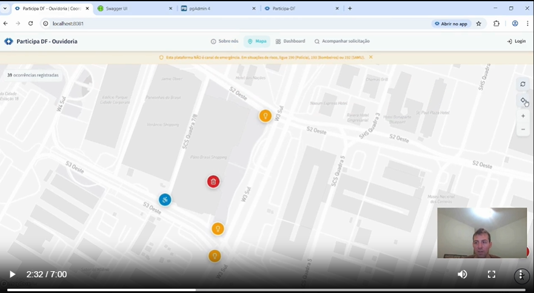
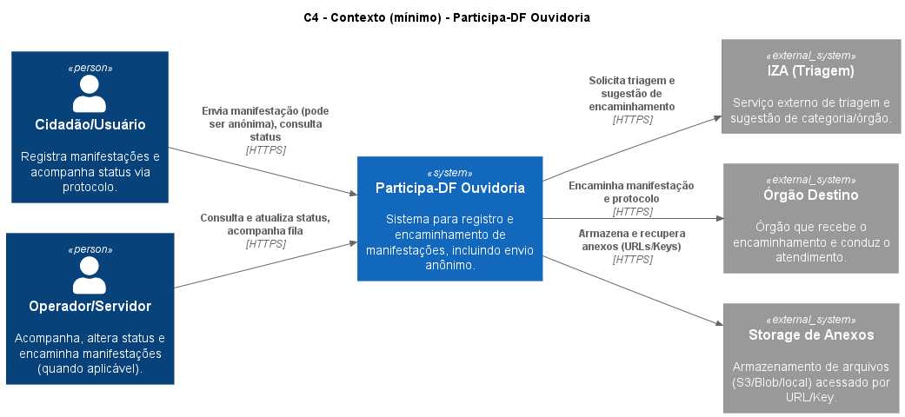
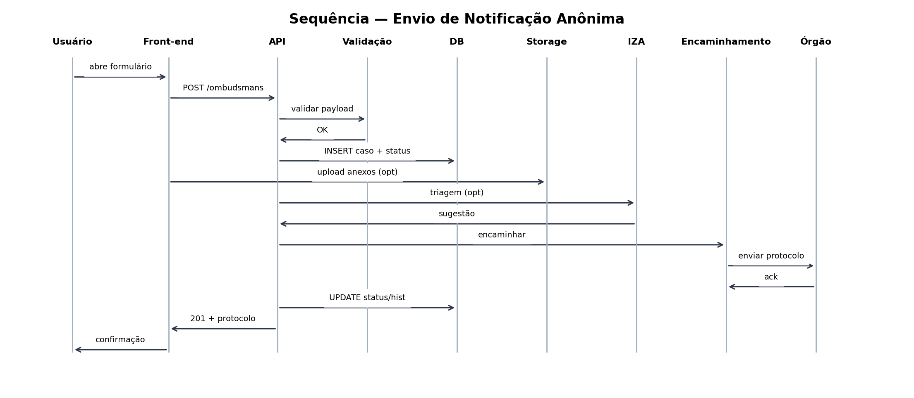

# Desafio Participa DF (CGDF) - Categoria Ouvidoria

## Participa DF Ouvidoria Mobile (PWA)

Esta solução implementa uma versão PWA mobile-first para Ouvidoria com foco em inclusão, multicanalidade, anonimato opcional, emissão automática de protocolo, consulta pública por protocolo e aderência a acessibilidade (WCAG 2.1 AA), conforme o Edital nº 10/2025 (1º Hackathon em Controle Social - Desafio Participa DF).

O repositório foi montado para ser testável do zero via Docker Compose, com documentação e evidências técnicas (OpenAPI, Swagger UI, C4, ADRs, runbook) para facilitar avaliação e demonstrar maturidade de engenharia.

### Vídeo de demonstração (exigência do edital)

[]([https://drive.google.com/file/d/1FQ8QwlLGU3a_36CVyeZ9YjmFPTy8gXPM/view?usp=drive_link](https://drive.google.com/file/d/1-3cN-RzytH2yIbDWCagfkE_yG8DDpkhN/view?usp=sharing))

**Ou acessar via Google Drive** (se acima não carregar):  
Link do vídeo: [https://drive.google.com/file/d/1FQ8QwlLGU3a_36CVyeZ9YjmFPTy8gXPM/view?usp=drive_link](https://drive.google.com/file/d/1-3cN-RzytH2yIbDWCagfkE_yG8DDpkhN/view?usp=sharing)

**O que o vídeo demonstra:** fluxo completo de manifestação, uso de múltiplos canais (texto, áudio, imagem, vídeo), anonimato opcional e recursos de acessibilidade.

---

## Por que esta proposta é competitiva para o edital

A categoria Ouvidoria exige PWA com multicanalidade, protocolo, anonimato e acessibilidade, além de integração com a arquitetura do Participa DF e triagem inteligente (IZA). Este projeto entrega os requisitos de produto e, adicionalmente, evidencia nível técnico por meio de:

1. Ambiente containerizado reproduzível, com healthchecks e dependências.
2. Contrato de API formal (OpenAPI) e inspeção via Swagger UI.
3. Persistência relacional com migrações versionadas (Flyway).
4. Rastreabilidade com status atual e histórico de transições.
5. Documentação profissional (C4 mínimo, ADRs, runbook, política de anonimato/LGPD e observabilidade mínima).

---

## Arquitetura (C4 mínimo) e evidências visuais

As visões principais do C4 estão em PNG para leitura imediata.




O fluxo ponta a ponta do envio anônimo também está documentado em sequência.



---

## Orquestração técnica (Docker Compose) - evidência de execução

O projeto sobe uma pilha completa com serviços separados (containers), com dependências e healthchecks para reduzir atrito na avaliação.

### Serviços no Docker Compose

- `postgres-ombudsman` (PostgreSQL 16) em `localhost:5433`
- `backend` (API Java 21 + Spring Boot) em `localhost:8080`
- `frontend` (PWA Vite/React servido via Nginx) em `localhost:8081`
- `pgadmin` (administração do banco) em `localhost:5050`

Observações de engenharia:

- O compose define `name: pdo`, então no Docker Desktop os serviços aparecem agrupados como `pdo`.
- `backend` depende do banco ficar saudável (`service_healthy`).
- `frontend` depende do backend ficar saudável.
- Existem healthchecks no banco, backend e frontend para facilitar diagnóstico.

### Subir o ambiente completo (recomendado para avaliadores)

Pré-requisitos:

- Docker
- Docker Compose (v2)

Comando:

```bash
cp .env.compose .env
docker compose up --build
```

Verificar status dos containers:

```bash
docker compose ps
```

Ver logs do backend (útil para avaliação técnica):

```bash
docker compose logs -f backend
```

Encerrar:

```bash
docker compose down
```

---

## Rotas, portas e proxy (mesmo origin)

O frontend roda em `http://localhost:8081` (Nginx) e encaminha requisições de API sob `/api/*` para o backend em `http://localhost:8080`.

Isso é importante para avaliação do hackathon porque:

- evita CORS no uso local
- simula uma experiência real (PWA e API sob o mesmo host)
- facilita abrir Swagger e endpoints sem configuração extra

---

## API, OpenAPI e Swagger UI (prova técnica)

A especificação OpenAPI fonte está em `docs/api/openapi.yaml` e deve refletir o contrato real de backend.

### Acessos locais (após subir com Docker)

- API base (direto no backend): http://localhost:8080/api
- Swagger UI: http://localhost:8080/swagger-ui/index.html
- OpenAPI JSON: http://localhost:8080/v3/api-docs
- Health (Actuator): http://localhost:8080/actuator/health

### Endpoints principais para demonstrar no vídeo e na avaliação

- Criar manifestação: `POST /api/v1/ombudsmans`
- Consultar por protocolo (público): `GET /api/v1/ombudsmans/by-protocol/{protocolNumber}`
- Auth (operador): `POST /api/v1/auth/login`
- (Opcional) Atualizar status: `PATCH /api/v1/ombudsmans/{id}/status`

---

## Banco de dados, migrações e pgAdmin (prova de persistência)

O banco é inicializado em container e o backend aplica migrações automaticamente com Flyway.

### Migrações (Flyway)

- Local: `backend/src/main/resources/db/migration/`
- As migrações criam tabelas e também fazem seed de usuários de teste.

### Credenciais do banco (ambiente local)

Usuário do banco:

- host: `localhost`
- porta: `5433`
- database: `ombudsman_db`
- usuário: `ombudsman_user`
- senha: `ombudsman_pass`

Esses valores são definidos no `.env.compose` e usados no compose para o container do Postgres.

### pgAdmin

- URL: http://localhost:5050
- login: `admin@example.com`
- senha: `admin`

O pgAdmin já vem pré-configurado com um servidor apontando para `postgres-ombudsman` usando `ombudsman_user`, para reduzir fricção na avaliação.

---

## Usuários de teste (para demonstrar login e perfis)

O projeto semeia usuários de teste via migrações SQL. Use estes usuários somente para demonstração local.

- Administrador (perfil ADMIN):
  - email: `admin@softkit.local`
  - senha: `Admin@123!`

- Usuária cidadã (perfil CUSTOMER):
  - email: `maria@softkit.local`
  - senha: `Maria@123!`

- Operador/agente (perfil AGENT):
  - email: `joao@softkit.local`
  - senha: `Joao@123!`

Recomendação para ambiente real:

- trocar senhas, segredos e tokens imediatamente
- nunca reutilizar estes seeds fora do contexto do hackathon

---

## Checklist do que demonstrar no vídeo (7 minutos, máximo)

1. Abrir o PWA e iniciar uma nova manifestação.
2. Marcar envio anônimo e destacar minimização de dados.
3. Selecionar localização no mapa.
4. Anexar evidências (imagem e áudio, e opcionalmente vídeo).
5. Enviar e mostrar o protocolo gerado.
6. Acompanhar por protocolo (sem login) e mostrar status/histórico.
7. Demonstrar 2 itens de acessibilidade (teclado, foco visível, componentes acessíveis e painel de acessibilidade).
8. Mostrar rapidamente o nível técnico:
   - Docker Desktop com os containers rodando (pdo: postgres, backend, frontend, pgadmin)
   - Swagger UI aberto com endpoints (e opcionalmente um "Try it out" no POST e no GET por protocolo)

---

## Documentação do projeto

- C4: `docs/c4/` e `docs/images/rendered/`
- ADRs: `docs/adr/`
- OpenAPI: `docs/api/openapi.yaml`
- State machine de status: `docs/domain/state-machine-status.md`
- Política de anonimato e LGPD: `docs/security/politica-anonimato-lgpd.md`
- Runbook: `docs/runbook/runbook.md`
- Observabilidade mínima: `docs/observability/observabilidade-basica.md`

Requisitos de ambiente e hardware:

- `REQUIREMENTS.md`

---

## Uso de Inteligência Artificial (transparência)

O edital permite uso de IA desde que documentado. Se IA foi utilizada, registrar aqui:

- quais ferramentas/modelos
- em qual etapa (protótipo, documentação, revisão)
- quais cuidados (sem dados pessoais reais, validação humana, revisão de segurança)

---

## Licença

MIT (quando presente no arquivo `LICENSE`).

---

## Contato

Para dúvidas e melhorias, abra uma issue no repositório.
