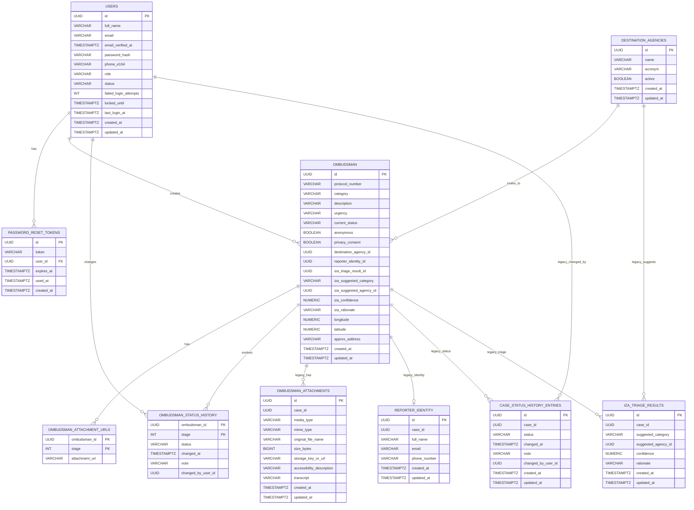
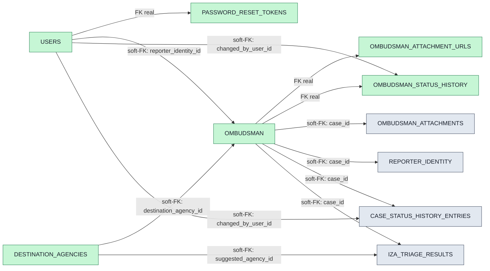

# Diagrama Entidade-Relacionamento (Ouvidoria)

## ERD (Mermaid `erDiagram`)

```mermaid
erDiagram

  USERS {
    UUID id PK
    VARCHAR full_name
    VARCHAR email
    TIMESTAMPTZ email_verified_at
    VARCHAR password_hash
    VARCHAR phone_e164
    VARCHAR role
    VARCHAR status
    INT failed_login_attempts
    TIMESTAMPTZ locked_until
    TIMESTAMPTZ last_login_at
    TIMESTAMPTZ created_at
    TIMESTAMPTZ updated_at
  }

  PASSWORD_RESET_TOKENS {
    UUID id PK
    VARCHAR token
    UUID user_id FK
    TIMESTAMPTZ expires_at
    TIMESTAMPTZ used_at
    TIMESTAMPTZ created_at
  }

  DESTINATION_AGENCIES {
    UUID id PK
    VARCHAR name
    VARCHAR acronym
    BOOLEAN active
    TIMESTAMPTZ created_at
    TIMESTAMPTZ updated_at
  }

  %% BACKEND (usado no backend atual)
  %% Observação: iza_* e location_* são campos embutidos persistidos no próprio OMBUDSMAN.
  %% Observação: destination_agency_id, reporter_identity_id e changed_by_user_id são soft-FKs (no modelo atual não há @ManyToOne).

  OMBUDSMAN {
    UUID id PK
    VARCHAR protocol_number
    VARCHAR category
    VARCHAR description
    VARCHAR urgency
    VARCHAR current_status
    BOOLEAN anonymous
    BOOLEAN privacy_consent
    UUID destination_agency_id
    UUID reporter_identity_id
    UUID iza_triage_result_id
    VARCHAR iza_suggested_category
    UUID iza_suggested_agency_id
    NUMERIC iza_confidence
    VARCHAR iza_rationale
    NUMERIC longitude
    NUMERIC latitude
    VARCHAR approx_address
    TIMESTAMPTZ created_at
    TIMESTAMPTZ updated_at
  }

  OMBUDSMAN_ATTACHMENT_URLS {
    UUID ombudsman_id PK
    INT stage PK
    VARCHAR attachment_url
  }

  OMBUDSMAN_STATUS_HISTORY {
    UUID ombudsman_id PK
    INT stage PK
    VARCHAR status
    TIMESTAMPTZ changed_at
    VARCHAR note
    UUID changed_by_user_id
  }

  %% LEGADO / NÃO USADO PELO BACKEND ATUAL (existem no schema/SQL, mas não há @Entity no backend hoje)

  OMBUDSMAN_ATTACHMENTS {
    UUID id PK
    UUID case_id
    VARCHAR media_type
    VARCHAR mime_type
    VARCHAR original_file_name
    BIGINT size_bytes
    VARCHAR storage_key_or_url
    VARCHAR accessibility_description
    VARCHAR transcript
    TIMESTAMPTZ created_at
    TIMESTAMPTZ updated_at
  }

  REPORTER_IDENTITY {
    UUID id PK
    UUID case_id
    VARCHAR full_name
    VARCHAR email
    VARCHAR phone_number
    TIMESTAMPTZ created_at
    TIMESTAMPTZ updated_at
  }

  CASE_STATUS_HISTORY_ENTRIES {
    UUID id PK
    UUID case_id
    VARCHAR status
    TIMESTAMPTZ changed_at
    VARCHAR note
    UUID changed_by_user_id
    TIMESTAMPTZ created_at
    TIMESTAMPTZ updated_at
  }

  IZA_TRIAGE_RESULTS {
    UUID id PK
    UUID case_id
    VARCHAR suggested_category
    UUID suggested_agency_id
    NUMERIC confidence
    VARCHAR rationale
    TIMESTAMPTZ created_at
    TIMESTAMPTZ updated_at
  }

  %% RELACIONAMENTOS
  USERS ||--o{ PASSWORD_RESET_TOKENS : has

  DESTINATION_AGENCIES ||--o{ OMBUDSMAN : routes_to
  USERS ||--o{ OMBUDSMAN : creates

  OMBUDSMAN ||--o{ OMBUDSMAN_ATTACHMENT_URLS : has
  OMBUDSMAN ||--o{ OMBUDSMAN_STATUS_HISTORY : evolves
  USERS ||--o{ OMBUDSMAN_STATUS_HISTORY : changes

  OMBUDSMAN ||--o{ OMBUDSMAN_ATTACHMENTS : legacy_has
  OMBUDSMAN ||--o| REPORTER_IDENTITY : legacy_identity
  OMBUDSMAN ||--o{ CASE_STATUS_HISTORY_ENTRIES : legacy_status
  USERS ||--o{ CASE_STATUS_HISTORY_ENTRIES : legacy_changed_by

  OMBUDSMAN ||--o{ IZA_TRIAGE_RESULTS : legacy_triage
  DESTINATION_AGENCIES ||--o{ IZA_TRIAGE_RESULTS : legacy_suggests


```

## Visualização colorida (Mermaid `flowchart`)

```mermaid
flowchart LR
  classDef backend fill:#c6f6d5,stroke:#2f855a,color:#1a202c,stroke-width:1px;
  classDef legado fill:#e2e8f0,stroke:#4a5568,color:#1a202c,stroke-width:1px;

  USERS[USERS]:::backend
  PASSWORD_RESET_TOKENS[PASSWORD_RESET_TOKENS]:::backend
  DESTINATION_AGENCIES[DESTINATION_AGENCIES]:::backend

  OMBUDSMAN[OMBUDSMAN]:::backend
  OMBUDSMAN_ATTACHMENT_URLS[OMBUDSMAN_ATTACHMENT_URLS]:::backend
  OMBUDSMAN_STATUS_HISTORY[OMBUDSMAN_STATUS_HISTORY]:::backend

  OMBUDSMAN_ATTACHMENTS[OMBUDSMAN_ATTACHMENTS]:::legado
  REPORTER_IDENTITY[REPORTER_IDENTITY]:::legado
  CASE_STATUS_HISTORY_ENTRIES[CASE_STATUS_HISTORY_ENTRIES]:::legado
  IZA_TRIAGE_RESULTS[IZA_TRIAGE_RESULTS]:::legado

  USERS -->|FK real| PASSWORD_RESET_TOKENS

  DESTINATION_AGENCIES -->|soft-FK: destination_agency_id| OMBUDSMAN
  USERS -->|soft-FK: reporter_identity_id| OMBUDSMAN

  OMBUDSMAN -->|FK real| OMBUDSMAN_ATTACHMENT_URLS
  OMBUDSMAN -->|FK real| OMBUDSMAN_STATUS_HISTORY
  USERS -->|soft-FK: changed_by_user_id| OMBUDSMAN_STATUS_HISTORY

  OMBUDSMAN -->|soft-FK: case_id| OMBUDSMAN_ATTACHMENTS
  OMBUDSMAN -->|soft-FK: case_id| REPORTER_IDENTITY
  OMBUDSMAN -->|soft-FK: case_id| CASE_STATUS_HISTORY_ENTRIES
  USERS -->|soft-FK: changed_by_user_id| CASE_STATUS_HISTORY_ENTRIES

  OMBUDSMAN -->|soft-FK: case_id| IZA_TRIAGE_RESULTS
  DESTINATION_AGENCIES -->|soft-FK: suggested_agency_id| IZA_TRIAGE_RESULTS

```
