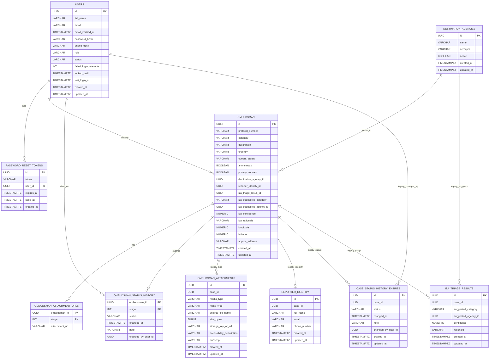

```mermaid
erDiagram

  USERS {
    UUID id PK
    VARCHAR full_name
    VARCHAR email
    TIMESTAMPTZ email_verified_at
    VARCHAR password_hash
    VARCHAR phone_e164
    VARCHAR role
    VARCHAR status
    INT failed_login_attempts
    TIMESTAMPTZ locked_until
    TIMESTAMPTZ last_login_at
    TIMESTAMPTZ created_at
    TIMESTAMPTZ updated_at
  }

  PASSWORD_RESET_TOKENS {
    UUID id PK
    VARCHAR token
    UUID user_id FK
    TIMESTAMPTZ expires_at
    TIMESTAMPTZ used_at
    TIMESTAMPTZ created_at
  }

  DESTINATION_AGENCIES {
    UUID id PK
    VARCHAR name
    VARCHAR acronym
    BOOLEAN active
    TIMESTAMPTZ created_at
    TIMESTAMPTZ updated_at
  }

  %% BACKEND (usado no backend atual)
  %% Observação: iza_* e location_* são campos embutidos persistidos no próprio OMBUDSMAN.
  %% Observação: destination_agency_id, reporter_identity_id e changed_by_user_id são soft-FKs (no modelo atual não há @ManyToOne).

  OMBUDSMAN {
    UUID id PK
    VARCHAR protocol_number
    VARCHAR category
    VARCHAR description
    VARCHAR urgency
    VARCHAR current_status
    BOOLEAN anonymous
    BOOLEAN privacy_consent
    UUID destination_agency_id
    UUID reporter_identity_id
    UUID iza_triage_result_id
    VARCHAR iza_suggested_category
    UUID iza_suggested_agency_id
    NUMERIC iza_confidence
    VARCHAR iza_rationale
    NUMERIC longitude
    NUMERIC latitude
    VARCHAR approx_address
    TIMESTAMPTZ created_at
    TIMESTAMPTZ updated_at
  }

  OMBUDSMAN_ATTACHMENT_URLS {
    UUID ombudsman_id PK
    INT stage PK
    VARCHAR attachment_url
  }

  OMBUDSMAN_STATUS_HISTORY {
    UUID ombudsman_id PK
    INT stage PK
    VARCHAR status
    TIMESTAMPTZ changed_at
    VARCHAR note
    UUID changed_by_user_id
  }

  %% LEGADO / NÃO USADO PELO BACKEND ATUAL (existem no schema/SQL, mas não há @Entity no backend hoje)

  OMBUDSMAN_ATTACHMENTS {
    UUID id PK
    UUID case_id
    VARCHAR media_type
    VARCHAR mime_type
    VARCHAR original_file_name
    BIGINT size_bytes
    VARCHAR storage_key_or_url
    VARCHAR accessibility_description
    VARCHAR transcript
    TIMESTAMPTZ created_at
    TIMESTAMPTZ updated_at
  }

  REPORTER_IDENTITY {
    UUID id PK
    UUID case_id
    VARCHAR full_name
    VARCHAR email
    VARCHAR phone_number
    TIMESTAMPTZ created_at
    TIMESTAMPTZ updated_at
  }

  CASE_STATUS_HISTORY_ENTRIES {
    UUID id PK
    UUID case_id
    VARCHAR status
    TIMESTAMPTZ changed_at
    VARCHAR note
    UUID changed_by_user_id
    TIMESTAMPTZ created_at
    TIMESTAMPTZ updated_at
  }

  IZA_TRIAGE_RESULTS {
    UUID id PK
    UUID case_id
    VARCHAR suggested_category
    UUID suggested_agency_id
    NUMERIC confidence
    VARCHAR rationale
    TIMESTAMPTZ created_at
    TIMESTAMPTZ updated_at
  }

  %% RELACIONAMENTOS
  USERS ||--o{ PASSWORD_RESET_TOKENS : has

  DESTINATION_AGENCIES ||--o{ OMBUDSMAN : routes_to
  USERS ||--o{ OMBUDSMAN : creates

  OMBUDSMAN ||--o{ OMBUDSMAN_ATTACHMENT_URLS : has
  OMBUDSMAN ||--o{ OMBUDSMAN_STATUS_HISTORY : evolves
  USERS ||--o{ OMBUDSMAN_STATUS_HISTORY : changes

  OMBUDSMAN ||--o{ OMBUDSMAN_ATTACHMENTS : legacy_has
  OMBUDSMAN ||--o| REPORTER_IDENTITY : legacy_identity
  OMBUDSMAN ||--o{ CASE_STATUS_HISTORY_ENTRIES : legacy_status
  USERS ||--o{ CASE_STATUS_HISTORY_ENTRIES : legacy_changed_by

  OMBUDSMAN ||--o{ IZA_TRIAGE_RESULTS : legacy_triage
  DESTINATION_AGENCIES ||--o{ IZA_TRIAGE_RESULTS : legacy_suggests


```
