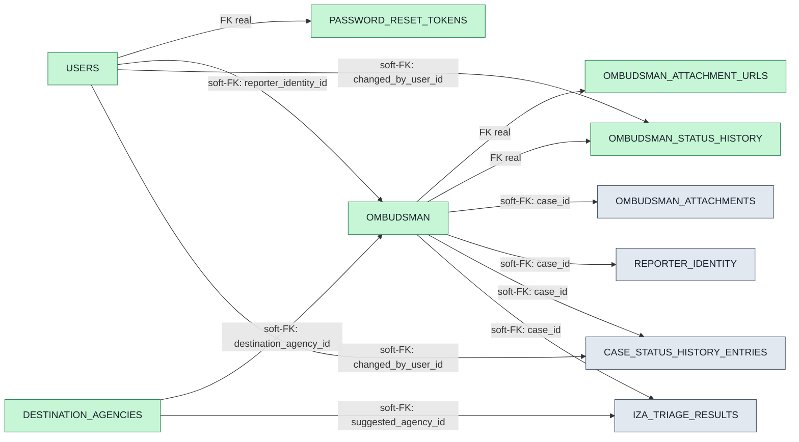

```mermaid
flowchart LR
  classDef backend fill:#c6f6d5,stroke:#2f855a,color:#1a202c,stroke-width:1px;
  classDef legado fill:#e2e8f0,stroke:#4a5568,color:#1a202c,stroke-width:1px;

  USERS[USERS]:::backend
  PASSWORD_RESET_TOKENS[PASSWORD_RESET_TOKENS]:::backend
  DESTINATION_AGENCIES[DESTINATION_AGENCIES]:::backend

  OMBUDSMAN[OMBUDSMAN]:::backend
  OMBUDSMAN_ATTACHMENT_URLS[OMBUDSMAN_ATTACHMENT_URLS]:::backend
  OMBUDSMAN_STATUS_HISTORY[OMBUDSMAN_STATUS_HISTORY]:::backend

  OMBUDSMAN_ATTACHMENTS[OMBUDSMAN_ATTACHMENTS]:::legado
  REPORTER_IDENTITY[REPORTER_IDENTITY]:::legado
  CASE_STATUS_HISTORY_ENTRIES[CASE_STATUS_HISTORY_ENTRIES]:::legado
  IZA_TRIAGE_RESULTS[IZA_TRIAGE_RESULTS]:::legado

  USERS -->|FK real| PASSWORD_RESET_TOKENS

  DESTINATION_AGENCIES -->|soft-FK: destination_agency_id| OMBUDSMAN
  USERS -->|soft-FK: reporter_identity_id| OMBUDSMAN

  OMBUDSMAN -->|FK real| OMBUDSMAN_ATTACHMENT_URLS
  OMBUDSMAN -->|FK real| OMBUDSMAN_STATUS_HISTORY
  USERS -->|soft-FK: changed_by_user_id| OMBUDSMAN_STATUS_HISTORY

  OMBUDSMAN -->|soft-FK: case_id| OMBUDSMAN_ATTACHMENTS
  OMBUDSMAN -->|soft-FK: case_id| REPORTER_IDENTITY
  OMBUDSMAN -->|soft-FK: case_id| CASE_STATUS_HISTORY_ENTRIES
  USERS -->|soft-FK: changed_by_user_id| CASE_STATUS_HISTORY_ENTRIES

  OMBUDSMAN -->|soft-FK: case_id| IZA_TRIAGE_RESULTS
  DESTINATION_AGENCIES -->|soft-FK: suggested_agency_id| IZA_TRIAGE_RESULTS

```
