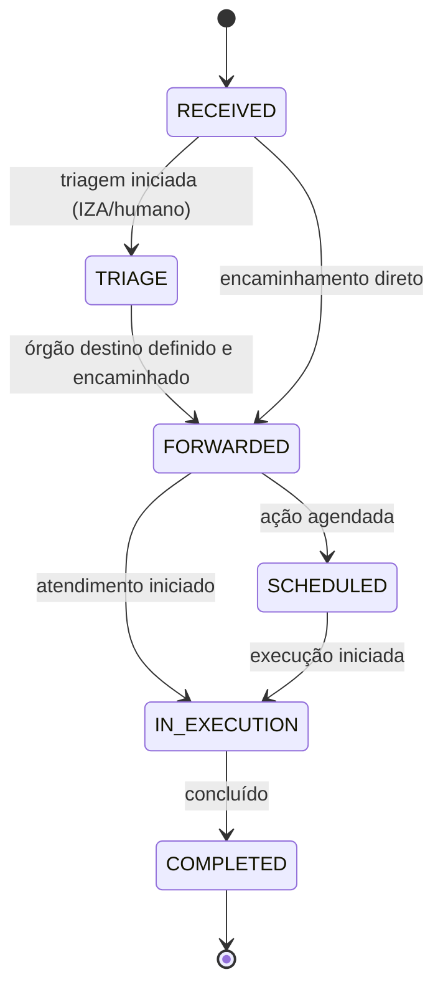

# Máquina de estados de manifestações (Ouvidoria)

Data: 2026-01-23

Este documento define o **ciclo de vida** de uma manifestação no sistema, os **estados permitidos**, as **transições válidas** e as **invariantes** que devem ser mantidas na persistência (status atual + histórico).

## Estados

Os estados abaixo refletem o contrato público atual (API) e devem ser tratados como o conjunto canônico no backend:

- `RECEIVED`: manifestação criada e persistida.
- `TRIAGE`: manifestação em triagem (automática e/ou humana).
- `FORWARDED`: encaminhada para órgão destino.
- `SCHEDULED`: ação agendada pelo órgão (quando aplicável).
- `IN_EXECUTION`: em execução/atendimento.
- `COMPLETED`: concluída/encerrada.

## Diagrama (Mermaid)

## Regras de transição

### Regras gerais
1) **Não pular para trás**: o fluxo é monotônico (não existe “desfazer” status). Caso haja correção operacional, registrar nova entrada de histórico explicando o motivo e usar um status específico de correção (se o produto exigir, criar um status novo via ADR).
2) **`currentStatus` deve refletir a última entrada do histórico**: sempre que `currentStatus` for alterado, **registrar** uma entrada correspondente em `status_history`.
3) **Histórico é append-only**: nunca editar registros de histórico; correções devem ser novas entradas.
4) **Campos de auditoria**: quando a transição for feita por operador autenticado, registrar `changedByUserId`. Para transições automáticas, `changedByUserId` pode ser nulo.

### Quem pode transicionar
- Usuário (público): apenas cria (`RECEIVED`) e consulta.
- Sistema: pode mover para `TRIAGE` (IZA) e efetivar `FORWARDED` se encaminhamento for automático.
- Operador: pode mover `FORWARDED -> SCHEDULED -> IN_EXECUTION -> COMPLETED` (de acordo com RBAC).

## Casos de falha e estados intermediários
Se integrações externas (IZA ou órgão destino) estiverem indisponíveis, recomenda-se modelar estados intermediários explícitos (por exemplo, `TRIAGE_PENDING`, `FORWARDING_PENDING`) ou manter em `RECEIVED/TRIAGE` com nota no histórico. A escolha deve ser formalizada via ADR caso vire requisito recorrente.
